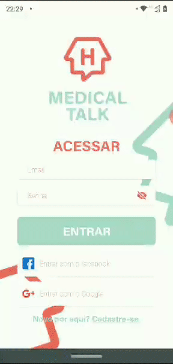

# Medical Talk

<h3>Plataforma digital para realizar consultas e agendamentos com acessibilidade.</h3>

Tem como principal objetivo a digitalização do atendimento e potencializar o cuidado médico à distância e, principalmente com qualidade para pacientes com algum tipo de deficiência.

 

Projeto desenvolvido durante o hackaton <b>Mega Hack Women</b> - Desafio Vitall + Unimed Fesp - Time 1

 

# Tecnologias Utilizadas

- <a href="https://reactnative.dev/docs/getting-started">React Native</a>
- <a href="https://akveo.github.io/react-native-ui-kitten/docs/">React Native UI Kitten</a>
- <a href="https://reactnavigation.org/docs/getting-started">React Navigation</a>
- <a href="https://firebase.google.com/docs">Firebase</a>
- <a href="https://www.npmjs.com/package/react-native-dropdownalert">React Native dropdownalert</a>
- <a href="https://docs.swmansion.com/react-native-gesture-handler/docs/">React Native gesture-handler</a>
- <a href="https://github.com/react-native-community/react-native-modal">React Native modal</a>
- <a href="https://github.com/software-mansion/react-native-reanimated">React Native reanimated</a>
- <a href="https://github.com/th3rdwave/react-native-safe-area-context">React Native safe-area-context</a>
- <a href="https://github.com/software-mansion/react-native-screens">React Native screens</a>
- <a href="https://github.com/react-native-community/react-native-svg">React Native svg</a>
- <a href="https://redux.js.org/introduction/getting-started">Redux</a>
- <a href="https://styled-components.com/docs">Styled Components</a>

# Participantes

- Ana Medrado
- Mirian Montenzi
- Gabriely Carris
